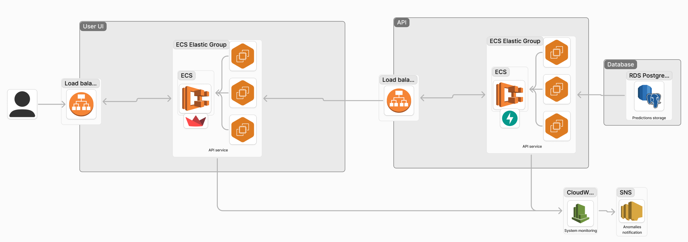
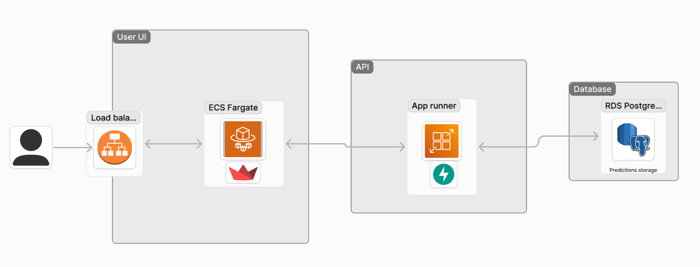
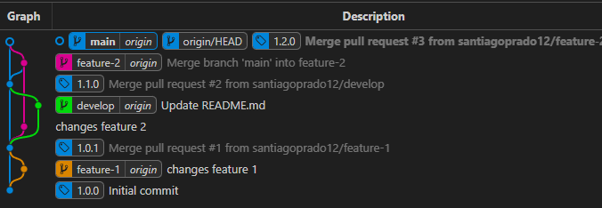
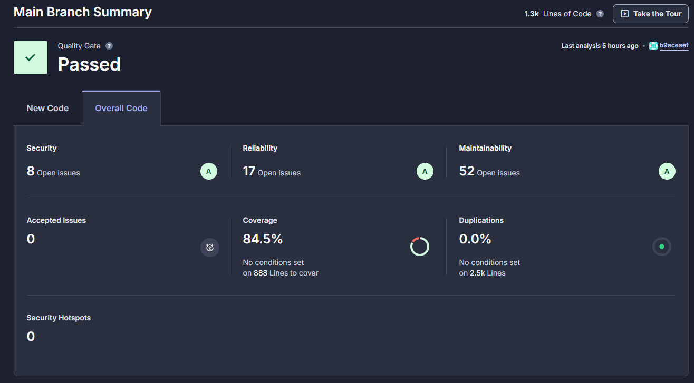

# Titanic end to end MLops project 🚢

## Introduction 

This project provides a machine learning-powered API designed to predict passenger survival probabilities on the Titanic dataset. Built using FastAPI, it includes both individual and batch prediction endpoints that leverage a pre-trained model for inference. The API is integrated with a PostgreSQL database for logging predictions, while a streamlined machine learning pipeline manages model training, validation, and feature selection. Additionally, a user-friendly interface built with Streamlit enables easy access for manual and batch predictions.


## Key Features 🗝️

- **FastAPI-Powered Endpoints:** Provides two main endpoints:

  - **/v1/prediction:** For single passenger survival predictions.
  - **/v1/batch_prediction:** For batch survival predictions.
- **ML Pipeline for Model Training:** Comprehensive machine learning pipeline includes:

- **Data preprocessing and feature engineering.**
  - Model training and hyperparameter tuning with options for multiple algorithms.
  - Automated feature selection using permutation importance.
- **Database Integration:** Utilizes PostgreSQL to log input data and predictions, ensuring traceability and data management.

- **User-Friendly Interface:** Built with Streamlit, this interface supports manual input and batch prediction through CSV uploads, allowing for easy testing and usage.

- **Modular CLI Commands:** Command-line commands to manage training, validation, and testing with code coverage, enabling seamless model lifecycle management.

## Package Structure 🌳

<pre>
src/
│
├── api/
│   ├── main.py                # Defines FastAPI endpoints for prediction
│   ├── app/
│   │   ├── batch_predictor.py # Handles batch predictions using the Predictor class
│   │   ├── predictor.py       # Core class for single predictions, manages model loading
│   │   ├── models.py          # Defines Pydantic models for API request/response schemas
│
├── db/
│   ├── docker-compose.yml     # Docker configuration for setting up PostgreSQL
│   ├── db_manager/
│   │   ├── abstract.py        # Interface for database management classes
│   │   ├── postgre_sql_manager.py # PostgreSQL-specific database operations
│   └── queries/
│       ├── create_api_table.sql  # SQL script to create tables for prediction logging
│       ├── select_all_api_table.sql # SQL query to retrieve all logged data
│
├── ml_core/
│   ├── train.py               # Training script for ML models, manages data processing and model selection
│   ├── validation.py          # Script to validate the model on test data
│
├── ml_pipelines/
│   ├── feature_selection.py   # Defines feature selection steps using permutation importance
│   ├── model_training.py      # Contains training logic and scoring of models
│   ├── pipeline_connection.py # Builds data pipelines including feature engineering and model training
│
├── cli/
│   ├── main.py                # CLI interface for model training, validation, testing, and SQL execution
│
├── front/
│   ├── titanic_prediction_interface.py # Streamlit interface for manual and batch predictions
│
└── utils/
    ├── data_functions.py      # Utility functions for data loading, preprocessing, and model evaluation
    ├── run_make.py            # Utility to run Makefile targets for testing and training automation
</pre>


## Package Overview 👀

### `api/`
- **`main.py`**: Contains FastAPI setup and endpoints for single and batch predictions.
- **`app/`**
  - `batch_predictor.py`: Extends `Predictor` to handle batch predictions.
  - `predictor.py`: Core prediction class, responsible for loading models, transforming input, and logging predictions.
  - `models.py`: Defines request and response schemas for prediction inputs using Pydantic.

### `db/`
- **`docker-compose.yml`**: Docker configuration for setting up a PostgreSQL database.
- **`db_manager/`**
  - `abstract.py`: Abstract base class defining the interface for database operations.
  - `postgre_sql_manager.py`: Manages PostgreSQL connections, queries, and DataFrame uploads.
- **`queries/`**
  - `create_api_table.sql`: SQL script to create the table structure for storing predictions.
  - `select_all_api_table.sql`: SQL query for retrieving all data from the predictions table.

### `ml_core/`
- **`train.py`**: Manages model training, testing, and saving the best model.
- **`validation.py`**: Validates model performance on test data and generates reports.

### `ml_pipelines/`
- **`feature_selection.py`**: Contains logic for feature selection based on permutation importance.
- **`model_training.py`**: Defines the model training workflow, including score calculation.
- **`pipeline_connection.py`**: Assembles data processing pipelines, applying preprocessing and feature engineering.

### `cli/`
- **`main.py`**: Provides command-line tools to train, validate, test, and execute SQL commands, with support for various model configurations.

### `front/`
- **`titanic_prediction_interface.py`**: Streamlit interface for manual and batch predictions, enabling easy interaction with the prediction API.

### `utils/`
- **`data_functions.py`**: Utility functions for data preprocessing, loading, and model validation.
- **`run_make.py`**: Helper to automate make commands, used for triggering training and testing processes.


## CLI Overview 💻

The project includes a command-line interface (CLI) built with Typer, allowing efficient management of model training, validation, testing, and SQL command execution. The CLI commands are defined in `src/cli/main.py` and provide the following options:

- **`train`**: Trains one or more specified models, with an optional accuracy threshold for model registration.
  - **Arguments**:
    - `-m`, `--model`: Specify one or more models to train (e.g., "random_forest", "gradient_boosting").
    - `-th`, `--acc-threshold`: Set an accuracy threshold (between 0 and 1). Models meeting this threshold are saved for deployment.

- **`validation`**: Validates the performance of the best model on a validation dataset. Optionally, retrains the model if it doesn't meet a specified accuracy threshold.
  - **Arguments**:
    - `-th`, `--acc-threshold`: Accuracy threshold for model retraining. If the current model score is below this threshold, a new model is trained.

- **`test`**: Runs the test suite with optional coverage reporting.
  - **Arguments**:
    - `-c`, `--coverage`: Flag to include code coverage reporting in the test results.

- **`run-sql`**: Executes a specified SQL file against the PostgreSQL database, retrieving results if applicable.
  - **Arguments**:
    - `sql_file`: Path to the SQL file to be executed.

### Usage Examples

```bash
# Train specified models with a minimum accuracy threshold
python -m src.cli.main train --model=knn --model=random_forest --model=gradient_boosting -th=0.7
```
```bash
# Validate the model with a minimum accuracy threshold of 0.75
python -m src.cli.main validation --acc-threshold 0.75
```

```bash
# Run tests with code coverage
python -m src.cli.main test --coverage
```

```bash
# Execute a SQL file against the PostgreSQL database
python -m src.cli.main run-sql --sql-file "src/db/queries/select_all_api_table.sql"
```

## Devcontainer Setup 🚀

The project includes a `.devcontainer` setup for development in Visual Studio Code (VSCode). The container is pre-configured with all the necessary extensions and environment variables to simplify development.

### To use the Devcontainer:

1. Open the project in VSCode.
2. When prompted, reopen the project in the Devcontainer.

## Environment Variables

The following environment variables are required to connect to the PostgreSQL database. They should be stored in the `.env` file in the root directory: (ask for the credentials)

```bash
POSTGRES_HOST=
POSTGRES_DB=
POSTGRES_USER=
POSTGRES_PASSWORD=
POSTGRES_PORT=
```


## Challenge development 💪


This section outlines the solution of the challenge, including the architecture, collaboration workflow, automation processes, and deploying the ML model as an API.

### Architecture
  
The proposed architecture:




A MVP was deployed using a simpler architecture:

API - https://9k6yjdcqae.us-east-1.awsapprunner.com/ <br />
UI - http://load-balancer-ui-2016319480.us-east-1.elb.amazonaws.com/ (only reachable using pc web browser)



### Collaboration




### Automation

[SonarCloud](https://sonarcloud.io) was integrated to this repo.




### ML Model Deployment Locally

- **API Development**: The API was developed using the FastAPI framework. You can find the code [here](src/api/). To deploy the API, use the provided [Dockerfile](API-Dockerfile). The api has 2 endpoints:
  - **/v1/prediction:** For single passenger survival predictions.
  - **/v1/batch_prediction:** For batch survival predictions.
  
- **UI Development**: The UI was developed with the Streamlit framework. The code is available [here](src/front), and deployment is handled by a [Dockerfile](UI-Dockerfile). The UI supports two types of predictions:
  - **Unique**: Perform a single prediction using the graphical interface and text fields.
  - **Batch**: Perform batch predictions using a CSV file. Try it out with this [example file](data/api-test.csv).
  
- **Estimations Storage**: Predictions and incoming data are stored in a PostgreSQL database. The database is deployed on RDS. You’ll need credentials saved in a `.env` file to access it.

- **Testing**: The codebase includes various tests to ensure the correct behavior of each module.

To run the full solution locally, execute:

```bash
# Ensure your .env file is set up
docker-compose up
```
However, both the UI and API are deployed online, and you can access them here:

API - https://9k6yjdcqae.us-east-1.awsapprunner.com/ <br />
UI - http://load-balancer-ui-2016319480.us-east-1.elb.amazonaws.com/ (only reachable using pc)

<br/>
<br/>
<br/>
<br/>
<br/>
<br/>
<br/>
<br/>

Hope you guys like it!<br/>
Made with ❤️ by Santiago Prado.